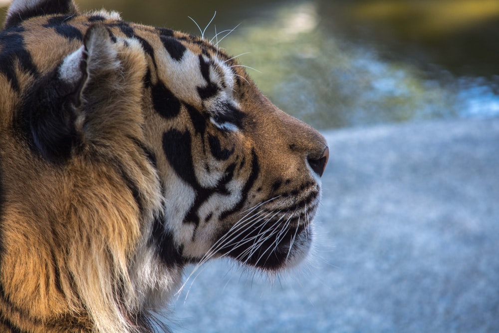
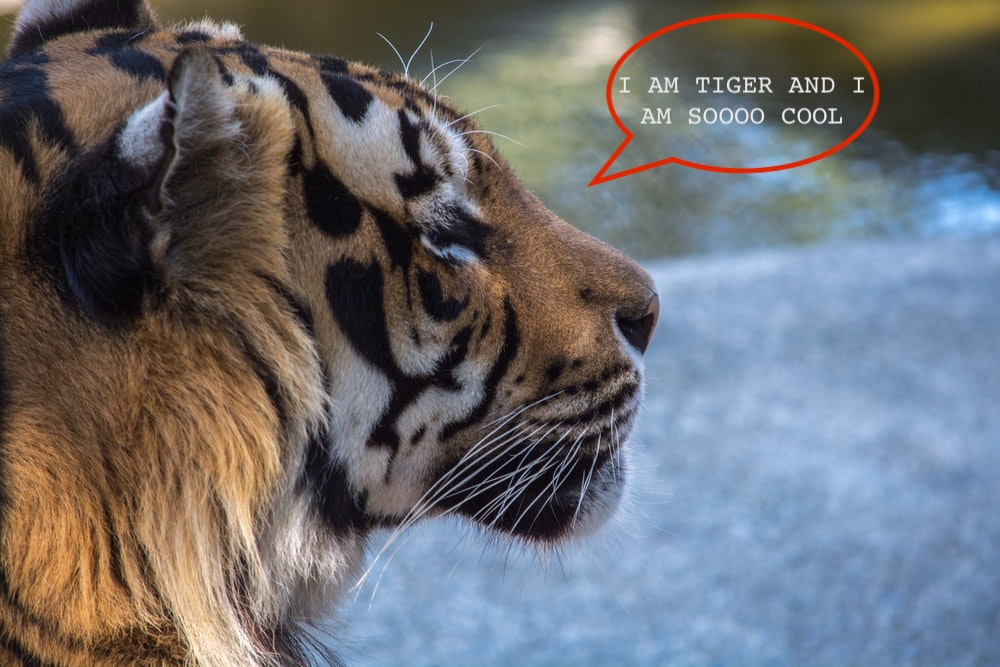
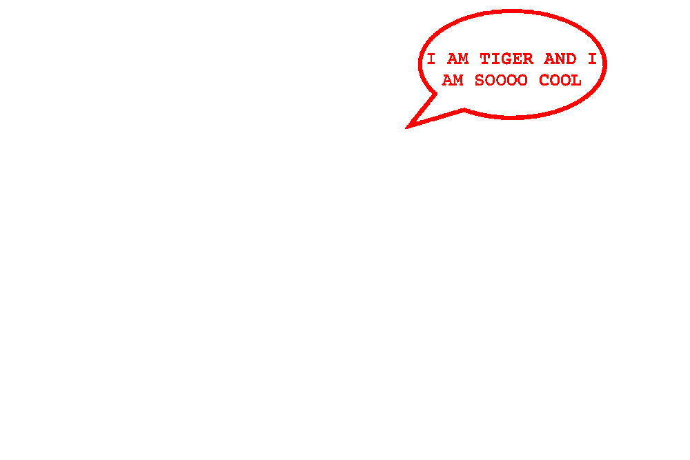

<p align="center">
  
</p>

<h1 align="center"> ODIFF </h1>
<h3 align="center"> The fastest* in the world pixel-by-pixel image difference tool. </h3>

## Why Odiff?

ODiff is blazing fast image comparison tool. Check [benchmarks](#benchmark) for the results, but it compares visual difference between 2 images in **milliseconds**. Thanks to [Ocaml](https://ocaml.org/) and it's blazing fast and predictable compiler we produce pretty fast and memory-efficient code, that can significantly speedup your CI pipeline.

## Demo

| base                           | comparison                       | diff                                  |
| ------------------------------ | -------------------------------- | ------------------------------------- |
|           |           |        |
|  |  |  |
|          |          |       |

## Features

- ✅ .png, .jpg, .jpg, .btm – Files supported.
- ✅ Cross-format comparison. Yes .jpg vs .png comparison.
- ✅ Supports comparison of images with different layouts
- ✅ Using [YIQ NTSC
  transmission algorithm](http://www.progmat.uaem.mx:8080/artVol2Num2/Articulo3Vol2Num2.pdf) to determine visual difference
- ✅ Zero dependencies for unix. Requires [libpng](http://www.libpng.org/pub/png/libpng.html) **only** for windows
- [ ] Anti-aliasing support is going to appear in the nearest future

## Usage

### Basic benchmark

Run the simple comparison. Image paths can be one of supported formats, diff output can only be `.png`.

```
odiff <IMG1 path> <IMG2 path> <DIFF output path>
```

### Diff image

Copies IMG1 into the diff and renders different pixels over the IMG1. Useful for snapshot tests results.

```
odiff <IMG1 path> <IMG2 path> <DIFF output path>
```

### Node.js

We also provides direct node.js binding for the `odiff`. Run the `odiff` from nodejs:

```js

```

## Installation

> ⛔️ **for windows users** ⛔️ It is required to install http://www.libpng.org/pub/png/libpng.html manually. But there is a great chance that it was already installed by some other program.

### Cross-platform

Use npm and node.js to install the binary. Make sure that this package is compiled directly to the platform binary executable, so npm script will load the all binaries and automatically install the right one for current platform.

```
npm install odiff-bin
```

Then give it a try 👀

```
odiff --help
```

### MacOS

```
brew install odiff
```

### Alpine Linux

```
apk add odiff
```

### From binaries

Download the binaries for your platform from [release](https://github.com/dmtrKovalenko/odiff/releases) page.

## Benchmarks

> Run the benchmarks by yourself. Instructions of how to run the benchmark is [here](./images)

Performance matters. If you are running 25000 image snapshots per month you can save **20 hours** of CI time per month by speeding up comparison time in just **3 seconds** per snapshot.

```
3s * 25000 / 3600 = 20,83333 hours
```

Here is `odiff` comparison with other popular visual difference solutions. We are going to compare a real-world use cases. Lets compare 2 screenshots of full-size [https://cypress.io](cypress.io) page:

| Command                                                                                    |      Mean [s] | Min [s] | Max [s] |    Relative |
| :----------------------------------------------------------------------------------------- | ------------: | ------: | ------: | ----------: |
| `pixelmatch www.cypress.io-1.png www.cypress.io.png www.cypress-diff.png`                  | 7.712 ± 0.069 |   7.664 |   7.896 | 1.82 ± 0.03 |
| ImageMagick `compare www.cypress.io-1.png www.cypress.io.png -compose src diff-magick.png` | 8.881 ± 0.121 |   8.692 |   9.066 | 2.09 ± 0.04 |
| `odiff www.cypress.io-1.png www.cypress.io.png www.cypress-diff.png`                       | 4.247 ± 0.053 |   4.178 |   4.344 |        1.00 |

Wow. Odiff is mostly 2 times faster than imagemagick and pixelmatch. And this will be even clearer if image will become larger. Lets compare a [4k image](images/water-4k.png) to find a difference with [another 4k image](images/water-4k-2.png):

| Command                                                                       |       Mean [s] | Min [s] | Max [s] |    Relative |
| :---------------------------------------------------------------------------- | -------------: | ------: | ------: | ----------: |
| `ODiffBin water-4k.png water-4k-2.png water-diff.png`                         |  4.873 ± 0.090 |   4.814 |   5.105 |        1.00 |
| `pixelmatch water-4k.png water-4k-2.png water-diff.png`                       | 10.614 ± 0.162 |  10.398 |  10.910 | 2.18 ± 0.05 |
| Imagemagick `compare water-4k.png water-4k-2.png -compose src water-diff.png` |  9.326 ± 0.436 |   8.819 |  10.394 | 1.91 ± 0.10 |

Yes it is significant improvement. And the produced difference will be the same for all 3 commands.
